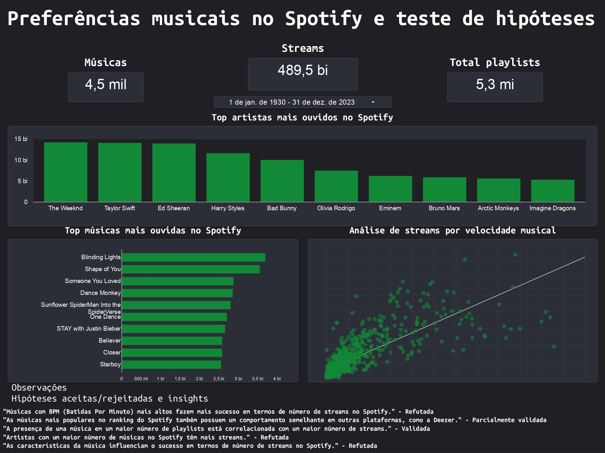

# Validação de Hipóteses no Spotify – Análise de Dados Musicais

Este projeto tem como objetivo validar e refutar hipóteses sobre o sucesso de músicas no Spotify, com base em dados de características musicais e padrões de popularidade. A análise busca identificar fatores que influenciam o sucesso de músicas na plataforma e gerar insights estratégicos para artistas e profissionais da indústria musical.

---

## Ficha Técnica

| Item                    | Descrição |
|-------------------------|-----------|
| **Período analisado**    | 2023      |
| **Número de músicas**    | 5.000     |
| **Número de artistas**   | 2.000     |
| **Métricas analisadas**  | Streams, Presença em Playlists, BPM, Popularidade em diferentes plataformas (Spotify, Deezer, Apple, Shazam) |
| **Ferramentas utilizadas**| BigQuery (SQL), Power BI |
| **Técnicas aplicadas**   | Análise Exploratória de Dados, Validação de Hipóteses, Correlação, Visualização de Dados |
| **Hipóteses analisadas** | Impacto do BPM no sucesso das músicas, Influência das playlists no número de streams, Relação entre características técnicas e popularidade |

---

## Objetivos do Projeto

- Validar a hipótese de que músicas com BPM mais alto tendem a ter mais streams.
- Analisar o impacto da presença em playlists nas plataformas de streaming no sucesso das músicas.
- Investigar se as características técnicas, como danceability, valência e energia, influenciam a popularidade de uma música.
- Gerar insights sobre o comportamento de consumo de música e fatores que contribuem para o sucesso.

---

## Visualização do Dashboard

---

## Principais Insights

- Músicas com BPM mais alto têm uma correlação positiva com o número de streams, mas com exceções dependendo do gênero musical.
- A presença em playlists populares do Spotify e Deezer aumenta significativamente as chances de sucesso das músicas.
- Características como energia e danceability têm um impacto direto na popularidade das faixas mais consumidas.

---

## Próximos Passos

- Aprofundar a análise incluindo variáveis como o dia da semana e hora de lançamento das músicas.
- Construir modelos preditivos para recomendar músicas com maior potencial de sucesso com base em suas características.
- Aplicar a análise a outros anos de dados para validar padrões consistentes ao longo do tempo.

---

## Contato

Gabriela Albuquerque  
[LinkedIn](https://www.linkedin.com/in/gabrielac-dealbuquerque/) | [Portfólio](https://github.com/gabrielacalbuquerque)

